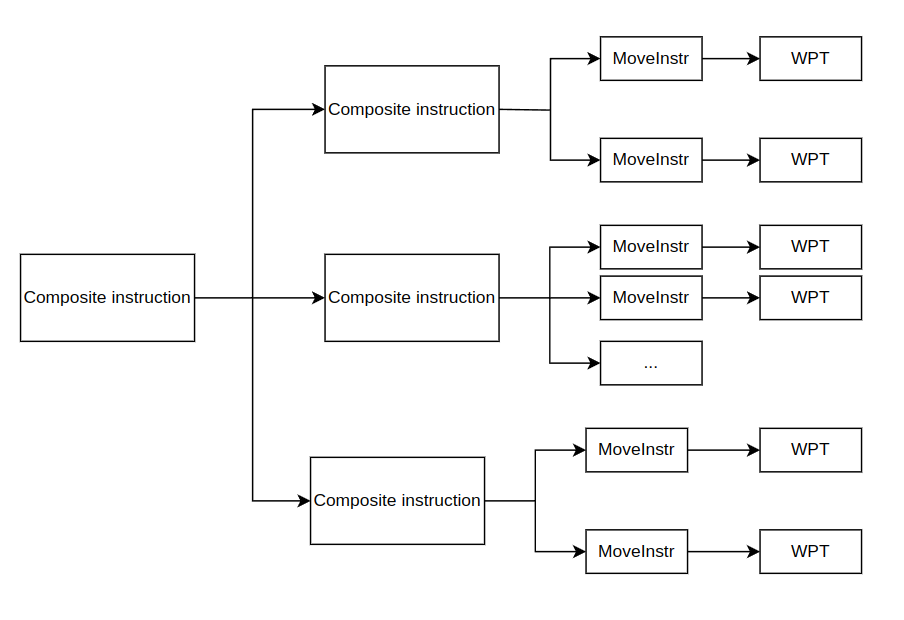

## 1 What I have in mind for our needs (simple architecture concern):
_It's not a full featured request, just basics need.
It seems that most of the need can be done easily with tesseract_

* **a serveur for planing that i can use in combination with behaviortree**
     <ins>Architectures</ins>
      - That can initialize the scene (loading urdf/srdf) via service call
      - That provide action/service for managing(CRUD) robot tool in the graph .
      - That provide action/service for managing(CRUD) perrception data (octomap) in the scene graph .
      - That could be contenerised (need to get the urdf mesh with ROS2 communication)
      - that provide action/service for feeding the program (waypoints/motion type) and another action/service for actual planning once program is feeded.
      - that will answer to plannification 
           -- with a ros trajectory_msg that can be send to a robot driver or displayed
           -- or with an error and data about the error (could be partial plannifcation to know where/why is the failure)
      -- with the ability to plan with constant speed or variable programmed speed (evolving along the path)
     ? instruction profiles should be fixed in the server ? would be over flexible to modify it on the go with a request.

<ins>Planning capabilities</ins>
 * Underconstrained planning
 * Underconstrained planning with 9 axis (graph based solution like descartes should explode cause too much IK solutions.)
 * Planning with tolerances (optimising a plan with orientation toleranced waypoint -- cf welding with process tolerance regarding orientation)

**<ins>Use case</ins>**
1. 9 axis welding cell (gantry + 6axis) for welding :
     - Underconstrained trajectories (Tool Z axis) with redundancies.
     - Graph based planner (ie descartes) could explode (too much nodes) --> sparse descartes + trajopt seems to be the way.

2. on A GP7:
     - Grasping of part 
     - Program trajectories with part in hand and static tool
3. Surfacing program on any surfaces for control with 6 axis robot:
     - Use case for Unordered MoveInstruction?


## 2 QUESTIONS/REMARKS ON SWORD:
**Usefull for testing profile** with a planner pipe.
**SRDF :** is it possible to import or export SRDF ?  
is it possible to **import program serialised from tesseract?**


## 4 TRAINING: reflexion about content

* Overview of tesseract (why? dedicated use case ?)

#### Tesseract architecture and Language
* Tesseract language structure
     - waypoints /  composite_instruction / Move_instruction / any_poly...


#### Tesseract Planning

* architecture and semantics: motion pipelinne, task, taskflow, profile, executor...

* common profile with common task.
     - SimpleMotionPlanning
     - Time parametrisation task (see below)
     - FT and CT denomination in the tasks
     - ...

* descripotion of the **different motion planner/Planning pipeline**

* **remote TCP** planning (part in hand and fixed tool)

* **Time parametrisation option**, how to make Constant speed traj & Variable but defined speed on traj. _i dont understand time parametrisation... if we change time parametrisation to have constant speed after planning (modify time, velocities, accel)  how can we ensure that the plan is still feasible? and if we check for feasibility (with respect to axis limits) and it's not feasible, then it should result in a failure. But maybe other plan could have success in time paramtrisation...

* **IK**: differnce between kdl LMA & KDL NR, why there is no ikfast ? 

#### SRDF
* Make SRDF (no snap for tesseract setup, just a review of pure srdf syntax)

#### other:
* Planning server:
     - is it a viable way of using tesseract with ROS? (client not updated in the repo)
     - Get feedback on planning ? (if it failed, why ?) graph provide info for developers but not user friendly.
* Modify scene graph (tool change, modify scene-> pop a part, pop a pcl (as voxel grid))
* OPW IK quick overview
* Planning for 9 axis (gantry + 6 axis)
* study case on Cogniman Cell (with remote TCP planning)
* Study case on 9 axis cell (gantry + 6 axis)
* how to analyse the tesseract dotgraph
* we can use **Instruction other than move**... I Understand the need if we use a post processor.  
What if we use full ROS with a robot driver. I know how to send a trajectory to the robot. If i have a gripper as well I know how to operate it.
But I will need a highlevel translator that will receiced instruction (traj or gripper I/O) and process them.

### Use case studies
* **use case1:** A GP7 picking a part and  making a contact operation with fixed tool.

* **use case2:** Welding with a 9 axis robot (gantry + 6 axis). underconstrained planning. (Using sparce descartes then trajopt?)  
 explore capabilties of orientation optimisation?


## 5 OBSERVATION WIP

 ### PROFILE IN MOVE INSTRUCTION

 

<ins>Why profile in both moveInstr and CompositeInstr ?</ins>
there are profiles in Move instruction 
```MoveInstruction(wp2, MoveInstructionType::LINEAR, process_profile);```
there are profiles in CompositeInstruction:
```CompositeInstruction raster_segment(process_profile);```

### ANYPOLY
I think I get the classic semantic pattern:


I dont get the meaning of anypoly that seems to cast in different classes.

### EXECUTOR and TASKFLOW
i'm not sure to get the diffrence between the taskflow and the executor.


here are the task _(request.name in the server)_:

those task are different from motion_pipeline referenced in SWORD documentation.


**so what is an executor?**
executor are listed through ```tesseract_planning::TaskComposerServer ->getAvailableExecutors```
only one available by default in the planning server: TaskflowExecutor
Why could I want more than one executor? 

### test 1
* my test programme:
```
Program: Composite Instruction, Description: Tesseract Composite Instruction
Program: { 
Program:     Composite Instruction, Description: from_start
Program:   {
Program:     Move Instruction, Move Type: 1, State WP: Pos=0 0 0 0 0 0, Description: Start
Program:     Move Instruction, Move Type: 1, Cart WP: xyz=0.4, 0, 1, Description: from_start_plan
Program:   }
Program:   Composite Instruction, Description: Raster # 1
Program:   {
Program:     Move Instruction, Move Type: 0, Cart WP: xyz=0.89, -0.01, 1 , Description: Tesseract Move Instruction
Program:     Move Instruction, Move Type: 0, Cart WP: xyz=0.891, -0.01, 1 , Description: Tesseract Move Instruction
Program:     Move Instruction, Move Type: 0, Cart WP: xyz=0.892, -0.01, 1 , Description: Tesseract Move Instruction
Program:   }
Program:   Composite Instruction, Description: to_end
Program:   {
Program:     Move Instruction, Move Type: 1, State WP: Pos=0 0 0 0 0 0 , Description: to_end_plan
Program:   }
Program: }
```

* using pipeline:   
```
goal_msg.request.name = "TrajOptPipeline";
```
problem: no time in tesseract trajectory

* using pipeline:   
```
goal_msg.request.name = "RasterFtPipeline";
```

Now, I've got traj timming, but only integer in tesseract_common::JointTrajectory.states.time
```
[WARN] approximate merit function got worse (-5.058e-01). (convexification is probably wrong to zeroth order)
```

and
```
Error:   Raster subgraph failed
```


i understand that task 'from_start' and 'to_end' are paralised, but done after Raster.  
indeed not done cause raster failed.  
I dont understand the second graph, what is SimpleMotionPlannerTask.  
SimpleMotionPlannerTask reference the raster graph which failed cause 
```
Failed to find valid solution:  OPT_PENALTY_ITERATION_LIMIT
```
i understand that trajopt reach iteration limit without solving the problem.


* ??? in the pipelines name, when you've got XXXpipeline, like in RasterFTpipelines it means that it handles multiple composites instructions (like freespace - raster - freespace). And when there is no *pipelines  it is a single planner (ie: without pipe between multiple planner).

* ??? what is CT and FT (RasterXXpipelines for instance)

* difference btw planInstruction and MoveInstruction


#### Profiles
* what is a profile ?
* why I can specifie profile in CompositeInstruction as well as in MoveInstruction


* a compositeInstruction can contain a compositeInstruction.
* if ManipInfo is pecified in level0 it doesn't has to be redefined in lower levels of CI.
* so when I declare waypoints in a MoveInstruction, the posiion is with respect to the base_link define in Manipulator Info (from the 'main' composite instruction).
